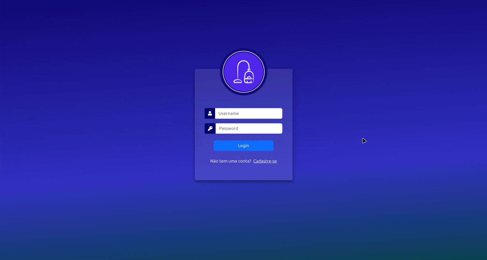

# ERP Open Source para Limpeza de Estofados

Este é um sistema de ERP (Enterprise Resource Planning) desenvolvido para gerenciar as operações de uma empresa de limpeza de estofados. Originalmente criado para atender às necessidades específicas de uma empresa, agora está disponível como um projeto open source, permitindo que outros utilizem, contribuam e adaptem o sistema conforme necessário para aprenderem mais sobre thymeleaf.



## Visão Geral do Projeto

O objetivo deste projeto é fornecer uma solução completa para empresas de limpeza de estofados, facilitando o gerenciamento de estoque, agendamento de serviços e análise de desempenho. O sistema busca otimizar processos, reduzir custos operacionais e melhorar a satisfação do cliente.

## Funcionalidades Principais

### 1. Gerenciamento de Estoque

- **Cadastro de Produtos**: Permite adicionar novos produtos e materiais ao estoque, com detalhes como nome, quantidade e descrição.
- **Controle de Inventário**: Monitora a quantidade de produtos disponíveis, permitindo o aviso quando os níveis estiverem baixos.
- **Histórico de Movimentação**: Registra todas as entradas e saídas de produtos do estoque.

### 2. Agendamento de Serviços

- **Cadastro de Clientes**: Permite registrar informações dos clientes, incluindo contato e histórico de serviços.
- **Agendamento de Serviços**: Facilita a programação de serviços de limpeza, permitindo a escolha de data e hora.

### 3. Interface Amigável

- **Design Responsivo**: O sistema é otimizado para uso em dispositivos móveis e desktops, garantindo uma experiência de usuário consistente.
- **Navegação Intuitiva**: Menus e funcionalidades são organizados de maneira lógica, facilitando a navegação e o uso do sistema.

## Tecnologias Utilizadas

- **Java**: Linguagem principal utilizada no desenvolvimento do sistema.
- **Spring Framework**: Utilizado para construir a arquitetura do projeto, aproveitando os recursos de segurança e gerenciamento de dependências.
- **Thymeleaf**: Motor de templates para renderização de páginas HTML, permitindo a integração entre dados dinâmicos e a interface do usuário.
- **Banco de Dados Relacional**: A aplicação se conecta a um banco de dados relacional para armazenamento persistente dos dados. Atualmente está em properties de test, basta mudar para de produção para definir aonde o banco se encontra. (MariaDB)

## Como Executar o Projeto

### Pré-requisitos

- Java Development Kit (JDK) 11 ou superior.
- Um banco de dados configurado (MariaDB).
- Maven ou Gradle para gerenciamento de dependências.

### Variáveis de Ambiente

Certifique-se de definir as seguintes variáveis de ambiente antes de executar o projeto:

```plaintext
MAIL=<seu_email_para_contato>
MAIL_PASS=<senha_do_email>
DB_URL_DOCKER=jdbc:mariadb://mariadb:3306/<seubanco>
DB_URL_LOCAL=jdbc:mariadb://localhost:3306/<seubanco>
DB_USER=<usuario_do_banco_de_dados>
DB_PASSWORD=<senha_do_banco_de_dados>
DB_DEFAULT=leonam_erp_teste
```

### Passos para Execução

Clone o Repositório https://github.com/cleytonorocha/erp_thymeleaf.git

docker-compose up -d
   ```

## Contribuição

Contribuições são bem-vindas! Para contribuir com o projeto.

## Licença

Este projeto está licenciado sob a MIT License - veja o arquivo [LICENSE](LICENSE) para mais detalhes.

## Contato

Para sugestões, dúvidas ou feedback, entre em contato:

- **Cleyton de Oliveira Rocha** - cleytonorocha@exemplo.com
